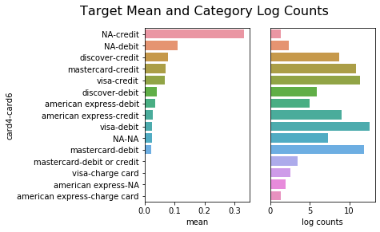
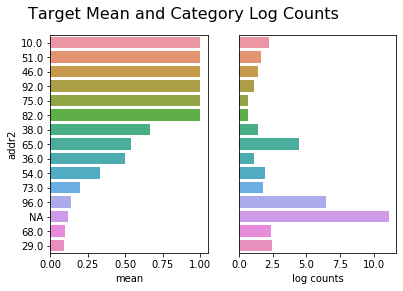
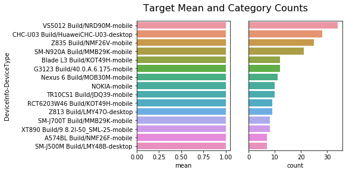
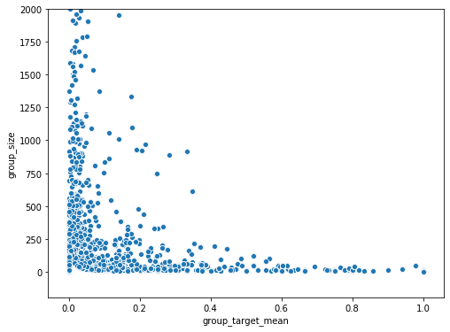
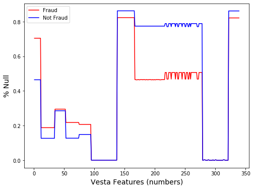
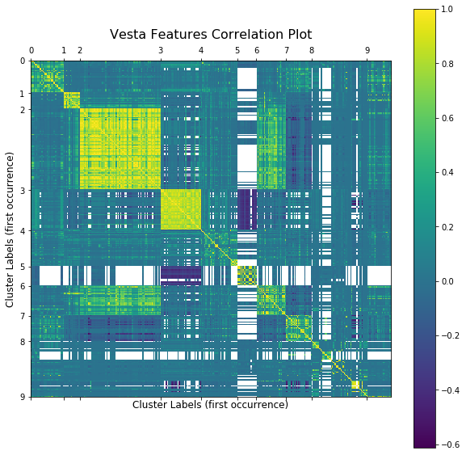
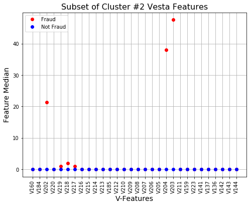
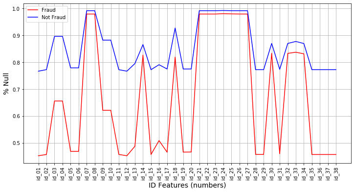
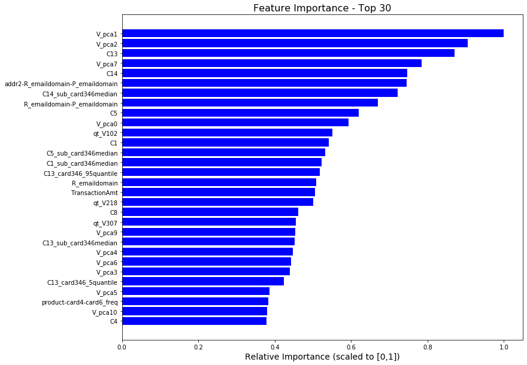

<h1>Table of Contents<span class="tocSkip"></span></h1>
<div class="toc"><ul class="toc-item"><li><span><a href="#Project-Overview" data-toc-modified-id="Project-Overview-1"><span class="toc-item-num">1&nbsp;&nbsp;</span>Project Overview</a></span><ul class="toc-item"><li><span><a href="#The-Problem" data-toc-modified-id="The-Problem-1.1"><span class="toc-item-num">1.1&nbsp;&nbsp;</span>The Problem</a></span></li><li><span><a href="#Solution" data-toc-modified-id="Solution-1.2"><span class="toc-item-num">1.2&nbsp;&nbsp;</span>Solution</a></span><ul class="toc-item"><li><span><a href="#My-approach:" data-toc-modified-id="My-approach:-1.2.1"><span class="toc-item-num">1.2.1&nbsp;&nbsp;</span>My approach:</a></span><ul class="toc-item"><li><span><a href="#Pre-Processing:" data-toc-modified-id="Pre-Processing:-1.2.1.1"><span class="toc-item-num">1.2.1.1&nbsp;&nbsp;</span>Pre-Processing:</a></span></li><li><span><a href="#Feature-Engineering:" data-toc-modified-id="Feature-Engineering:-1.2.1.2"><span class="toc-item-num">1.2.1.2&nbsp;&nbsp;</span>Feature Engineering:</a></span></li><li><span><a href="#Predictive-Model:" data-toc-modified-id="Predictive-Model:-1.2.1.3"><span class="toc-item-num">1.2.1.3&nbsp;&nbsp;</span>Predictive Model:</a></span></li></ul></li></ul></li></ul></li><li><span><a href="#Import-Common-Modules" data-toc-modified-id="Import-Common-Modules-2"><span class="toc-item-num">2&nbsp;&nbsp;</span>Import Common Modules</a></span></li><li><span><a href="#Project-Setup" data-toc-modified-id="Project-Setup-3"><span class="toc-item-num">3&nbsp;&nbsp;</span>Project Setup</a></span></li><li><span><a href="#Load-Raw-Data" data-toc-modified-id="Load-Raw-Data-4"><span class="toc-item-num">4&nbsp;&nbsp;</span>Load Raw Data</a></span><ul class="toc-item"><li><span><a href="#Comments" data-toc-modified-id="Comments-4.1"><span class="toc-item-num">4.1&nbsp;&nbsp;</span>Comments</a></span></li></ul></li><li><span><a href="#Merge-Transaction-and-Identity-Datasets" data-toc-modified-id="Merge-Transaction-and-Identity-Datasets-5"><span class="toc-item-num">5&nbsp;&nbsp;</span>Merge <code>Transaction</code> and <code>Identity</code> Datasets</a></span></li><li><span><a href="#Sample-figures-and-stats-from-EDA" data-toc-modified-id="Sample-figures-and-stats-from-EDA-6"><span class="toc-item-num">6&nbsp;&nbsp;</span>Sample figures and stats from EDA</a></span><ul class="toc-item"><li><span><a href="#Interaction-of-card-features-card4-card6" data-toc-modified-id="Interaction-of-card-features-card4-card6-6.1"><span class="toc-item-num">6.1&nbsp;&nbsp;</span>Interaction of card features card4-card6</a></span><ul class="toc-item"><li><span><a href="#Comments" data-toc-modified-id="Comments-6.1.1"><span class="toc-item-num">6.1.1&nbsp;&nbsp;</span>Comments</a></span></li></ul></li><li><span><a href="#Regions" data-toc-modified-id="Regions-6.2"><span class="toc-item-num">6.2&nbsp;&nbsp;</span>Regions</a></span><ul class="toc-item"><li><span><a href="#Comments:" data-toc-modified-id="Comments:-6.2.1"><span class="toc-item-num">6.2.1&nbsp;&nbsp;</span>Comments:</a></span></li></ul></li><li><span><a href="#Interaction-of-Purchaser-and-Receiver-email-ID-domain" data-toc-modified-id="Interaction-of-Purchaser-and-Receiver-email-ID-domain-6.3"><span class="toc-item-num">6.3&nbsp;&nbsp;</span>Interaction of Purchaser and Receiver email-ID domain</a></span><ul class="toc-item"><li><span><a href="#Comments:" data-toc-modified-id="Comments:-6.3.1"><span class="toc-item-num">6.3.1&nbsp;&nbsp;</span>Comments:</a></span></li></ul></li><li><span><a href="#Devices" data-toc-modified-id="Devices-6.4"><span class="toc-item-num">6.4&nbsp;&nbsp;</span>Devices</a></span><ul class="toc-item"><li><span><a href="#Comments" data-toc-modified-id="Comments-6.4.1"><span class="toc-item-num">6.4.1&nbsp;&nbsp;</span>Comments</a></span></li></ul></li><li><span><a href="#Card-Group" data-toc-modified-id="Card-Group-6.5"><span class="toc-item-num">6.5&nbsp;&nbsp;</span>Card Group</a></span><ul class="toc-item"><li><span><a href="#Card-Groups-common-to-train-and-test-datasets" data-toc-modified-id="Card-Groups-common-to-train-and-test-datasets-6.5.1"><span class="toc-item-num">6.5.1&nbsp;&nbsp;</span>Card Groups common to train and test datasets</a></span></li><li><span><a href="#Comments" data-toc-modified-id="Comments-6.5.2"><span class="toc-item-num">6.5.2&nbsp;&nbsp;</span>Comments</a></span></li></ul></li><li><span><a href="#Time-in-the-dataSet" data-toc-modified-id="Time-in-the-dataSet-6.6"><span class="toc-item-num">6.6&nbsp;&nbsp;</span>Time in the dataSet</a></span><ul class="toc-item"><li><span><a href="#Comments:" data-toc-modified-id="Comments:-6.6.1"><span class="toc-item-num">6.6.1&nbsp;&nbsp;</span>Comments:</a></span></li></ul></li><li><span><a href="#Vesta-Features" data-toc-modified-id="Vesta-Features-6.7"><span class="toc-item-num">6.7&nbsp;&nbsp;</span>Vesta Features</a></span><ul class="toc-item"><li><span><a href="#Percentage-Null-(Fraud-vs-Not-Fraud)" data-toc-modified-id="Percentage-Null-(Fraud-vs-Not-Fraud)-6.7.1"><span class="toc-item-num">6.7.1&nbsp;&nbsp;</span>Percentage Null (Fraud vs Not Fraud)</a></span></li><li><span><a href="#Feature-correlations" data-toc-modified-id="Feature-correlations-6.7.2"><span class="toc-item-num">6.7.2&nbsp;&nbsp;</span>Feature correlations</a></span></li><li><span><a href="#Comments" data-toc-modified-id="Comments-6.7.3"><span class="toc-item-num">6.7.3&nbsp;&nbsp;</span>Comments</a></span></li></ul></li><li><span><a href="#ID-Features" data-toc-modified-id="ID-Features-6.8"><span class="toc-item-num">6.8&nbsp;&nbsp;</span>ID Features</a></span><ul class="toc-item"><li><span><a href="#Percentage-Nulls" data-toc-modified-id="Percentage-Nulls-6.8.1"><span class="toc-item-num">6.8.1&nbsp;&nbsp;</span>Percentage Nulls</a></span></li><li><span><a href="#Comments" data-toc-modified-id="Comments-6.8.2"><span class="toc-item-num">6.8.2&nbsp;&nbsp;</span>Comments</a></span></li></ul></li></ul></li><li><span><a href="#Generate-Features" data-toc-modified-id="Generate-Features-7"><span class="toc-item-num">7&nbsp;&nbsp;</span>Generate Features</a></span><ul class="toc-item"><li><span><a href="#Reload-environment" data-toc-modified-id="Reload-environment-7.1"><span class="toc-item-num">7.1&nbsp;&nbsp;</span>Reload environment</a></span></li><li><span><a href="#Email-domain-based-features" data-toc-modified-id="Email-domain-based-features-7.2"><span class="toc-item-num">7.2&nbsp;&nbsp;</span>Email domain based features</a></span></li><li><span><a href="#Device-based-features" data-toc-modified-id="Device-based-features-7.3"><span class="toc-item-num">7.3&nbsp;&nbsp;</span>Device based features</a></span></li><li><span><a href="#Distance-based-features" data-toc-modified-id="Distance-based-features-7.4"><span class="toc-item-num">7.4&nbsp;&nbsp;</span>Distance based features</a></span></li><li><span><a href="#Miscellaneous-interaction-features" data-toc-modified-id="Miscellaneous-interaction-features-7.5"><span class="toc-item-num">7.5&nbsp;&nbsp;</span>Miscellaneous interaction features</a></span></li><li><span><a href="#proxyid1-based-features" data-toc-modified-id="proxyid1-based-features-7.6"><span class="toc-item-num">7.6&nbsp;&nbsp;</span>proxyid1 based features</a></span></li><li><span><a href="#proxyid2-based-features" data-toc-modified-id="proxyid2-based-features-7.7"><span class="toc-item-num">7.7&nbsp;&nbsp;</span>proxyid2 based features</a></span></li><li><span><a href="#Time-based-features" data-toc-modified-id="Time-based-features-7.8"><span class="toc-item-num">7.8&nbsp;&nbsp;</span>Time based features</a></span></li><li><span><a href="#Match-based-features" data-toc-modified-id="Match-based-features-7.9"><span class="toc-item-num">7.9&nbsp;&nbsp;</span>Match based features</a></span></li><li><span><a href="#Counts-based-features" data-toc-modified-id="Counts-based-features-7.10"><span class="toc-item-num">7.10&nbsp;&nbsp;</span>Counts based features</a></span></li><li><span><a href="#Missing-value-based-features" data-toc-modified-id="Missing-value-based-features-7.11"><span class="toc-item-num">7.11&nbsp;&nbsp;</span>Missing value based features</a></span></li><li><span><a href="#Vesta-features" data-toc-modified-id="Vesta-features-7.12"><span class="toc-item-num">7.12&nbsp;&nbsp;</span>Vesta features</a></span></li><li><span><a href="#Merge-all-new-feature-sets" data-toc-modified-id="Merge-all-new-feature-sets-7.13"><span class="toc-item-num">7.13&nbsp;&nbsp;</span>Merge all new feature sets</a></span></li><li><span><a href="#Preprocess-all-features-for-Tree-models" data-toc-modified-id="Preprocess-all-features-for-Tree-models-7.14"><span class="toc-item-num">7.14&nbsp;&nbsp;</span>Preprocess all features for Tree models</a></span></li><li><span><a href="#Save-all-generated-features-to-disk" data-toc-modified-id="Save-all-generated-features-to-disk-7.15"><span class="toc-item-num">7.15&nbsp;&nbsp;</span>Save all generated features to disk</a></span></li></ul></li><li><span><a href="#Build-Predictive-Model" data-toc-modified-id="Build-Predictive-Model-8"><span class="toc-item-num">8&nbsp;&nbsp;</span>Build Predictive Model</a></span><ul class="toc-item"><li><span><a href="#Reload-environment" data-toc-modified-id="Reload-environment-8.1"><span class="toc-item-num">8.1&nbsp;&nbsp;</span>Reload environment</a></span></li><li><span><a href="#Tree-Based-Predictive-Model" data-toc-modified-id="Tree-Based-Predictive-Model-8.2"><span class="toc-item-num">8.2&nbsp;&nbsp;</span>Tree Based Predictive Model</a></span><ul class="toc-item"><li><span><a href="#Model-Parameter-Tuning" data-toc-modified-id="Model-Parameter-Tuning-8.2.1"><span class="toc-item-num">8.2.1&nbsp;&nbsp;</span>Model Parameter Tuning</a></span></li><li><span><a href="#Model-Training-&amp;-Scores" data-toc-modified-id="Model-Training-&amp;-Scores-8.2.2"><span class="toc-item-num">8.2.2&nbsp;&nbsp;</span>Model Training &amp; Scores</a></span></li><li><span><a href="#Create-a-Submission-File" data-toc-modified-id="Create-a-Submission-File-8.2.3"><span class="toc-item-num">8.2.3&nbsp;&nbsp;</span>Create a Submission File</a></span></li><li><span><a href="#Model-Performance-&amp;-Feature-Importance" data-toc-modified-id="Model-Performance-&amp;-Feature-Importance-8.2.4"><span class="toc-item-num">8.2.4&nbsp;&nbsp;</span>Model Performance &amp; Feature Importance</a></span></li></ul></li><li><span><a href="#Reflections" data-toc-modified-id="Reflections-8.3"><span class="toc-item-num">8.3&nbsp;&nbsp;</span>Reflections</a></span></li></ul></li></ul></div>

# Project Overview


## The Problem


Given anonymized eCommerce transaction data which were labelled "**Fraud**" or "**Not Fraud**", the task was to build a binary classifier model that will predict whether a given transaction is “Fraud” or ''Not Fraud" in new data. The labeling logic for "Fraud" was as follows: If an eCommerce transaction was reported & and a chargeback was issued, then that transaction was labelled "Fraud". All the previous transactions by that person/account/card were also labelled "Fraud" for 120 days after the first report; subsequently removing the label if no more transactions were reported by the customer.

The dataset for this Kaggle competition was provided by Vesta Corporation. Vesta Corporation is a forerunner in guaranteed e-commerce payment solutions.

<br>
<div style="text-align:center">
Credit: Photo by rupixen on Unsplash    
</div>

Here's an excerpt from the competition description:
>In this competition, you’ll benchmark machine learning models on a challenging large-scale dataset. The data comes from Vesta's real-world e-commerce transactions and contains a wide range of features from device type to product features. You also have the opportunity to create new features to improve your results.
>If successful, you’ll improve the efficacy of fraudulent transaction alerts for millions of people around the world, helping hundreds of thousands of businesses reduce their fraud loss and increase their revenue.


## Solution
I worked on this competition along with Nishan Singh Mann (a Data Scientist based out of New York). We tried a couple approaches to this problem. The approaches that put us in the top 50% of the competitors (**~0.91 on AUC-ROC metric**), involved building Tree based models with careful preprocessing and feature engineering. Due to the number, variety and obscuring of features, Tree based models were chosen, as they make fewer assumptions about the data and hence the preprocessing requirements are not as extensive.

### My approach:
    A tree based predictive model with impetus on careful preprocessing and feature engineering.
The given dataset had 400+ features and lots of missing data. A majority of the input features were numeric and categorical features, many had a high cardinality. As many of the input features were made obscure, it was difficult to guess what was the data in many of the columns. However, some information about groups of columns was provided which helped towards preprocessing and feature engineering.

#### Pre-Processing:
- Applying mean-imputation on a large group of numeric features, followed by Z-scaling and dimensionality reduction with PCA.
- Missing values in the rest of the numeric features were filled a placeholder (a large outlier).
- Missing values in categorical features were filled with a placeholder category and subsequently Label-Encoded.
- Removing highly null columns and single valued columns from the dataset.

#### Feature Engineering:
- Interaction between specific categorical features.
- Given the nature of "Fraud" labelling logic, it was likely that a certain card-holder/customer had a higher likelihood of having fraudulent transactions for 120 days since fraud was reported on the account. Due to this, it made sense to uniquely identify users in the dataset. For this Proxy-IDs were created using groups of loose-identifiers.
- Proxy-ID group based features like intra-group quantile-transformations, medians, counts etc.
- Rationalized some categorical features like device names, operating system, browser names and versions etc.
- Time based features like day of week and hour of day, and daily and hourly aggregations of certain numeric features.
- Missing values sums for certain groups of features.
- Frequncy and target-mean encoding of certain high cardinality categorical variables.


#### Predictive Model:
- A RandomForest based Tree model was fit along with class weighting to handle class-imbalance in the data (~96% of "Not Fraud"). 
- Time based validation splits by months.


# Import Common Modules


```python
%run ../src/common_modules.py
```

# Project Setup


```python
%run ../src/project_setup.py
```

# Load Raw Data


```python
# Indentity Data
train_id = pd.read_csv(os.path.join(raw_data_dir, "train_identity.csv"))
test_id = pd.read_csv(os.path.join(raw_data_dir, "test_identity.csv"))

# Transaction Data
train_tx = pd.read_csv(os.path.join(raw_data_dir, "train_transaction.csv"))
test_tx = pd.read_csv(os.path.join(raw_data_dir,"test_transaction.csv"))
```


```python
# train datasets shape
train_tx.shape, train_id.shape
```


    ((590540, 394), (144233, 41))


```python
# test datasets shape
test_tx.shape, test_id.shape
```


    ((506691, 393), (141907, 41))


## Comments
- The overall objective is to predict the class labels for transactions in the `test_tx` dataset.
- Not all transactions in the Transaction dataset have corresponding Identity data.
- `TransactionID` is the key to join the two datasets.

# Merge `Transaction` and `Identity` Datasets


```python
# Left join Transaction and ID datasets
train = pd.merge(train_tx, train_id, on='TransactionID', how='left')
test = pd.merge(test_tx, test_id, on='TransactionID', how='left')
```


```python
# save pre-preprocessed data to disk as parquet files
train.to_parquet(os.path.join( interim_data_dir , "train.parquet"))
test.to_parquet(os.path.join( interim_data_dir ,"test.parquet"))
```


```python
# clean up notebook - delete raw data
del train_id, test_id, train_tx, test_tx, train, test
gc.collect()
```


    20


# Sample figures and stats from EDA


```python
# Load saved train and test from disk
train = pd.read_parquet(os.path.join( interim_data_dir , "train.parquet"))
test = pd.read_parquet(os.path.join( interim_data_dir ,"test.parquet"))
```


```python
# Target class distrinution in training set
train['isFraud'].value_counts()
```


    0    569877
    1     20663
    Name: isFraud, dtype: int64


## Interaction of card features card4-card6


```python
from src.visualization.visualize import plot_categorical_target_dist
```


```python
plot_categorical_target_dist(train, ['card4','card6'], 
                             ['isFraud'], (0,20),(8,4), 
                             plt_adjust_left=0.4, log_counts=True)
```

    Index(['card4', 'card6', 'count', 'mean'], dtype='object')





### Comments 
- Credit cards have higher rates of Fraud on average.
- Fraud rates are also high if `Card4` is missing

## Regions


```python
plot_categorical_target_dist(train, ['addr2'], ['isFraud'], 
                             (0,15),(8,4), plt_adjust_left=0.3, log_counts=True)
```

    Index(['addr2', 'count', 'mean'], dtype='object')





### Comments:
- Some regions are more likely sources of Fraud

## Interaction of Purchaser and Receiver email-ID domain


```python
plot_categorical_target_dist(train, ['P_emaildomain','R_emaildomain'], ['isFraud'], 
                             (0,15),(8,4), plt_adjust_left=0.3, log_counts=False)
```

    Index(['P_emaildomain', 'R_emaildomain', 'count', 'mean'], dtype='object')


### Comments:
- Some email domains are more likley sources of Fraud. 

## Devices


```python
plot_categorical_target_dist(train, ['DeviceInfo','DeviceType'], ['isFraud'], 
                             (0,15),(8,4), plt_adjust_left=0.3, log_counts=False)
```

    Index(['DeviceInfo', 'DeviceType', 'count', 'mean'], dtype='object')





### Comments
- Some devices have higher sources of Fraud. These could belong to specific users.

## Card Group

Group cards by `'card1','card2','card3','card4','card5','card6'` and calculate target mean.


```python
from IPython.display import HTML
from IPython.display import display

# Taken from https://stackoverflow.com/questions/31517194/how-to-hide-one-specific-cell-input-or-output-in-ipython-notebook
tag = HTML('''<script>
code_show=true; 
function code_toggle() {
    if (code_show){
        $('div.cell.code_cell.rendered.selected div.input').hide();
    } else {
        $('div.cell.code_cell.rendered.selected div.input').show();
    }
    code_show = !code_show
} 
$( document ).ready(code_toggle);
</script>
<a href="javascript:code_toggle()">Toggle Code Visibility</a>.''')

```


```python
display(tag)
```


<script>
code_show=true; 
function code_toggle() {
    if (code_show){
        $('div.cell.code_cell.rendered.selected div.input').hide();
    } else {
        $('div.cell.code_cell.rendered.selected div.input').show();
    }
    code_show = !code_show
} 

</script>
<a href="javascript:code_toggle()">Toggle Code Visibility</a>.


```python
display?
```


```python
# Generate card group
card_group = ['card1','card2','card3','card4','card5','card6']
data = train.loc[:,  card_group + ['isFraud']]
data['card_group'] = ut.create_category_interactions(data, card_group)
group_obj = data.groupby('card_group')
data['group_target_mean'] = group_obj['isFraud'].transform(np.mean)
data['group_size'] = group_obj['isFraud'].transform('count')

# Plot group_size vs group_target_mean 
plt.figure(figsize=(8,6))
sns.scatterplot(x= data['group_target_mean'], y =  data['group_size'])
_ = plt.ylim([-200,2000])
```





### Card Groups common to train and test datasets


```python
train_card_groups = set(create_category_interactions(train, card_group))
test_card_groups = set(create_category_interactions(test, card_group))
```


```python
len(train_card_groups), len(test_card_groups)
```


    (14893, 14326)


```python
len(train_card_groups.intersection(test_card_groups))
```


    9908


### Comments
- Number large groups reduces with higher target mean.
- There are 9908 card groups that are common to Train and Test sets. - So its not few big card groups that make up majority of Fraud.

## Time in the dataSet


```python
(train['TransactionDT']//(60*60*24)).describe()
```


    count    590540.000000
    mean         84.729199
    std          53.437277
    min           1.000000
    25%          35.000000
    50%          84.000000
    75%         130.000000
    max         182.000000
    Name: TransactionDT, dtype: float64


```python
(test['TransactionDT']//(60*60*24)).describe()
```


    count    506691.000000
    mean        311.086427
    std          55.058802
    min         213.000000
    25%         263.000000
    50%         314.000000
    75%         362.000000
    max         395.000000
    Name: TransactionDT, dtype: float64


### Comments:
- TransactionDT has time-delta from a fixed date 
- Turns out this is in seconds starting one day before the first transaction in the dataset.
- Training set: Days {1-182} and Test set: Days {213-395} from the reference date (i.e. Day 0).

## Vesta Features


```python
vesta_features = train.columns[train.columns.str.contains(r"^V\d")]
```


```python
data_fraud = train.loc[ (train["isFraud"]==1), vesta_features]
data_notfraud = train.loc[ (train["isFraud"]==0), vesta_features]
```

### Percentage Null (Fraud vs Not Fraud)


```python
plt.figure(figsize=(8,6))
plt.plot( np.arange(1,340), data_fraud.isnull().sum().values/data_fraud.shape[0] , 'r')
plt.plot( np.arange(1,340), data_notfraud.isnull().sum().values/data_notfraud.shape[0], 'b')
plt.xlabel('Vesta Features (numbers)', fontdict={"fontsize":14})
plt.ylabel('% Null', fontdict={"fontsize":14})
plt.legend(['Fraud', 'Not Fraud'])
plt.show()
```





### Feature correlations 


```python
from src.visualization.visualize import correlation_plot
```


```python
cluster_labels, sorted_feature_index = correlation_plot(train.loc[:,vesta_features],
                                         'Cluster Labels (first occurrence)', 
                                         'Vesta Features Correlation Plot', 
                                         n_clusters=10)
```





```python
# Example - Cluster #2
clabels = cluster_labels[sorted_feature_index]
cluster2 = vesta_features[sorted_feature_index][(clabels == 2)]
```


```python
# Cluster 2 sorted index
sorted_index = train.iloc[:, 166:278].apply(lambda x: x.quantile(0.5)).sort_values().index
```


```python
plt.figure(figsize=(8,6))
plt.plot(data_fraud.loc[:, sorted_index[20:50]].apply(lambda x: x.quantile(0.5)), 'or')
plt.plot(data_notfraud.loc[:, sorted_index[20:50]].apply(lambda x: x.quantile(0.5)), 'ob')
plt.legend(['Fraud', 'Not Fraud'], loc='upper left')
plt.xlabel('V-Features', fontdict={"fontsize":14})
plt.ylabel('Feature Median', fontdict={"fontsize":14})
plt.title('Subset of Cluster #2 Vesta Features', fontdict={"fontsize":16})
xticks = plt.xticks(rotation=90)
plt.grid()
```





### Comments
- Among Vesta Features clusters 2, 3, 5 are inetesting. Ex: From cluster 2 V204, V203, V218 and V102 have different median values for Fraud vs Not Fraud.
- Missing Values among features V167 - V278 seem useful. 

## ID Features

### Percentage Nulls


```python
id_features = train.columns[train.columns.str.contains('^id_\d+')]
```


```python
plt.figure(figsize=(12,6))
plt.plot(train.loc[mFraud, id_features].isnull().sum()/mFraud.sum(), '-r')
plt.plot(train.loc[~mFraud, id_features].isnull().sum()/(~mFraud).sum(), '-b')
xticks = plt.xticks(rotation=90)
plt.legend(['Fraud', 'Not Fraud'], loc='upper left')
plt.xlabel('ID Features (numbers)', fontdict={"fontsize":14})
plt.ylabel('% Null', fontdict={"fontsize":14})
plt.grid()
```





```python
id_null_diff = train.loc[mFraud, id_features].isnull().sum()/mFraud.sum() - \
                train.loc[~mFraud, id_features].isnull().sum()/(~mFraud).sum() 
```


```python
# Useful ID features for missing values based features
id_null_diff[id_null_diff.abs() > 0.3].index
```


    Index(['id_01', 'id_02', 'id_05', 'id_06', 'id_11', 'id_12', 'id_13', 'id_15',
           'id_17', 'id_19', 'id_20', 'id_28', 'id_29', 'id_31', 'id_35', 'id_36',
           'id_37', 'id_38'],
          dtype='object')


### Comments
- ID features have a lot of missing values. Some ID features have significant difference of % Null for Fraud vs Not Fraud. These could be useful.

# Generate Features

- email domain based features
- device based features
- distance based features
    - dist1/dist2, frequencies of dist1,dist2,  etc. ?
- card based features
    - card gorup "id-proxy" based features
- Time based features
    - Dataset day
    - Hour of day
    - Day from reference day.
    - Counts per day etc. 
- Product and card group based features

## Reload environment


```python
# Clean up everyting
%reset -f
```


```python
%run ../src/common_modules.py
```


```python
%run ../src/project_setup.py
```


```python
# Load saved train and test from disk
train = pd.read_parquet(os.path.join( interim_data_dir , "train.parquet"))
test = pd.read_parquet(os.path.join( interim_data_dir ,"test.parquet"))
```

## Email domain based features


```python
from src.features.build_features import  get_email_based_features

tr_email, te_email = get_email_based_features(train, test)
```

## Device based features


```python
from src.features.build_features import get_device_based_features

tr_device, te_device = get_device_based_features(train, test)
```

## Distance based features


```python
from src.features.build_features import get_dist_based_features

tr_dist, te_dist = get_dist_based_features(train, test)
```

## Miscellaneous interaction features


```python
from src.features.build_features import get_misc_interaction_features

tr_misc_int, te_misc_int = get_misc_interaction_features(train, test)
```

## proxyid1 based features


```python
from src.features.build_features import get_proxyid1_based_features

tr_proxy_id_s1, te_proxy_id_s1  = get_proxyid1_based_features(train, test)
```

## proxyid2 based features


```python
from src.features.build_features import get_proxyid2_based_features

tr_proxy_id_s2, te_proxy_id_s2  = get_proxyid2_based_features(train, test)
```

##  Time based features


```python
from src.features.build_features import get_time_based_features

tr_time_s1, te_time_s1 = get_time_based_features(train, test)
```

## Match based features


```python
from src.features.build_features import get_match_features

tr_match, te_match = get_match_features(train, test)
```

## Counts based features


```python
from src.features.build_features import get_counts_features

tr_counts, te_counts = get_counts_features(train, test)
```

## Missing value based features


```python
from src.features.build_features import get_na_based_features

tr_nabased, te_nabased = get_na_based_features(train, test)
```

## Vesta features


```python
from src.features.build_features import get_vesta_features

tr_vesta, te_vesta = get_vesta_features(train, test)
```

## Merge all new feature sets


```python
fs1_list_train = [tr_email,tr_device, tr_dist,
                  tr_misc_int, tr_proxy_id_s1,
                  tr_proxy_id_s2, tr_time_s1, 
                  tr_counts, tr_match,
                  tr_nabased, tr_vesta]

fs1_list_test =  [te_email, te_device, te_dist, 
                  te_misc_int, te_proxy_id_s1, 
                  te_proxy_id_s2, te_time_s1,
                  te_counts, te_match,
                  te_nabased, te_vesta]
```


```python
train_fs1 = pd.concat(fs1_list_train, axis=1)

test_fs1  =  pd.concat(fs1_list_test, axis=1)
```

## Preprocess all features for Tree models


```python
from src.features.build_features import get_preprocessed_features

train_proc, test_proc, target = get_preprocessed_features(train, test, train_fs1, test_fs1)
```

    Dropping 9 highly null or single valued columns ...


## Save all generated features to disk


```python
# Check if all columns are the same
all(train_proc.columns == test_proc.columns)
```


    True


```python
# training set
train_proc.to_parquet(os.path.join(processed_data_dir, 'train_proc.parquet'))
# test set
test_proc.to_parquet(os.path.join(processed_data_dir, 'test_proc.parquet'))
# target
target.to_frame().to_parquet(os.path.join(processed_data_dir, 'target.parquet'))
```

# Build Predictive Model

## Reload environment


```python
# Clean up everyting
%reset -f
```


```python
%run ../src/common_modules.py
```


```python
%run ../src/project_setup.py
```


```python
# Load saved train_fs1, test_fs1, and target  from disk
train = pd.read_parquet(os.path.join(processed_data_dir, 'train_proc.parquet'))
test = pd.read_parquet(os.path.join(processed_data_dir, 'test_proc.parquet'))
target = pd.read_parquet(os.path.join(processed_data_dir, 'target.parquet'))
```

## Tree Based Predictive Model

###  Model Parameter Tuning

Model tuning code is not included here since it is computationally intesive. However, a schematic showing the validation scheme used is included (see below). Due to the time based split between train and test, a similar split was adopted for validation. While this does not readily estimate generalization error, it does allow for model tuning as it compares the performance on the same datasets.

<br>
<div style="text-align:center">
 Validation scheme for model tuning. Numbers are months.  
</div>


### Model Training & Scores


```python
from sklearn.ensemble import RandomForestClassifier
from sklearn.metrics import roc_auc_score
```


```python
# Rng seed - for reproducibility
seed = 123
```


```python
clf = RandomForestClassifier(n_estimators=250, max_depth=25, min_samples_leaf=50,
                             class_weight = "balanced_subsample", 
                             min_impurity_decrease= 1e-8,
                             random_state=seed, n_jobs=-1, verbose=0)
```


```python
clf.fit(train, target['isFraud'].values)
```


    RandomForestClassifier(bootstrap=True, class_weight='balanced_subsample',
                           criterion='gini', max_depth=25, max_features='auto',
                           max_leaf_nodes=None, min_impurity_decrease=1e-08,
                           min_impurity_split=None, min_samples_leaf=50,
                           min_samples_split=2, min_weight_fraction_leaf=0.0,
                           n_estimators=250, n_jobs=-1, oob_score=False,
                           random_state=123, verbose=0, warm_start=False)


```python
ypred_train = clf.predict_proba(train)
ypred_test = clf.predict_proba(test)
```

### Create a Submission File


```python
# Load submission file from disk
fpath = os.path.join(raw_data_dir, 'sample_submission.csv')
sample_sub = pd.read_csv(fpath)

# Check if the indices match with test
all(test['TransactionID'] == sample_sub['TransactionID'])
```


    True


```python
sample_sub['isFraud'] = ypred_test[:,1]

# Submission filename rf_model_<hash of model params>__<hash of feature names>.csv
submission_file_name = 'rf_model_' + str(hash(str(clf.get_params()))) + '__' + \
                        str(hash(','.join(train.columns.tolist()))) + '.csv'

sample_sub.to_csv(os.path.join(submissions_dir, submission_file_name), index=False)

print('Submission File name is: %s' % submission_file_name)
```

    Submission File name is: rf_model_643756591330381440__5478427170226401782.csv


### Model Performance & Feature Importance

- The AUC-ROC score for this model on:
    - Training set is ~0.98
    - Test set private leaderboard is ~0.90 and public leaderboard is ~0.91


```python
from src.visualization.visualize import plot_feature_importance

plot_feature_importance(estimator=clf, dftrain=train)
```





## Reflections

- Given the Fraud labelling logic, it would help to refine the proxy-ID. This would help group transactions from each client card. 
- Ensembling with boosted tree models or linear models would also improve the score.
- Feature selection like recursive elimation would help reduce the model model complexity and training time.
- Target mean encoded features which were part of the model I submitted are not included here. Encoding high cardinality categorical variables that way provides improves the scores further to ~0.91 on private leaderboard and ~0.92 on public leader board (top 50% models).
